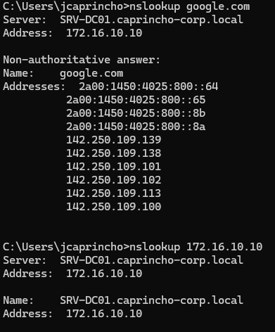
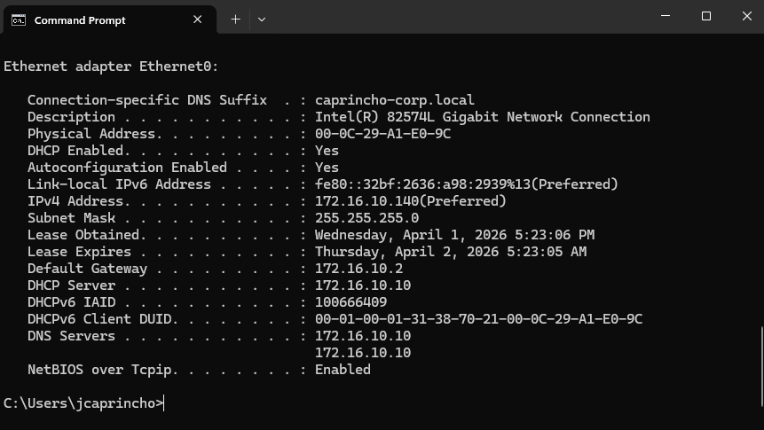
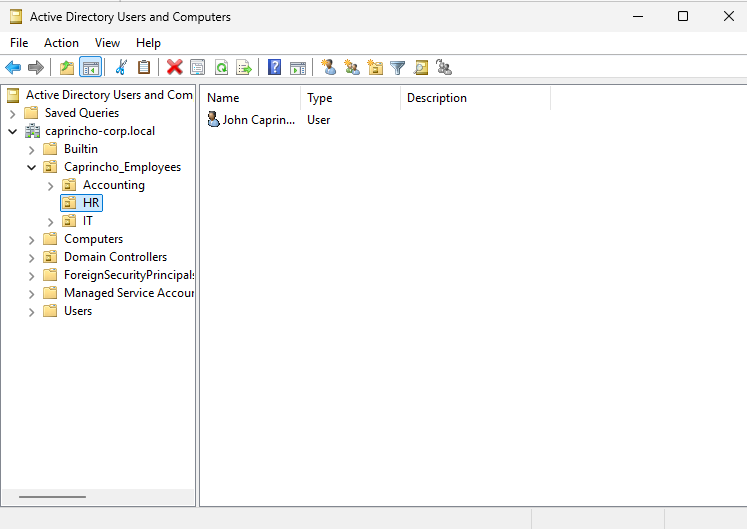
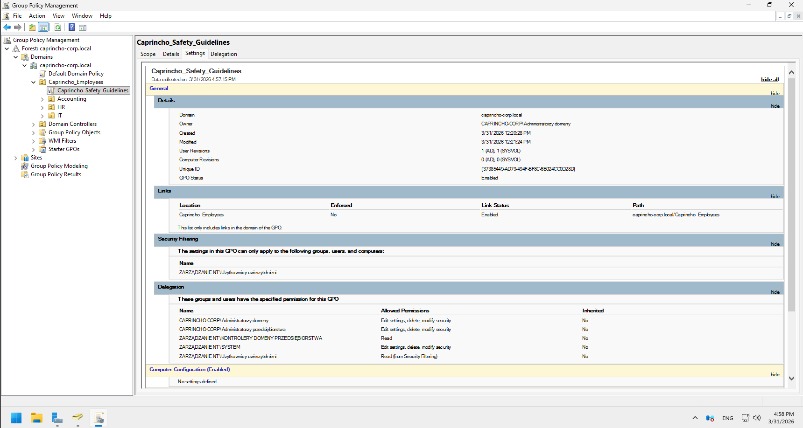
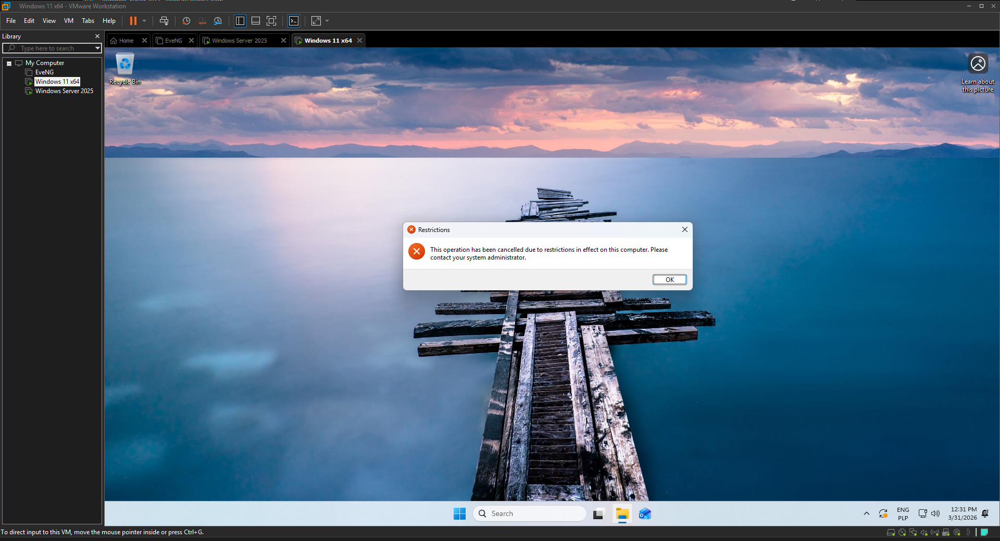
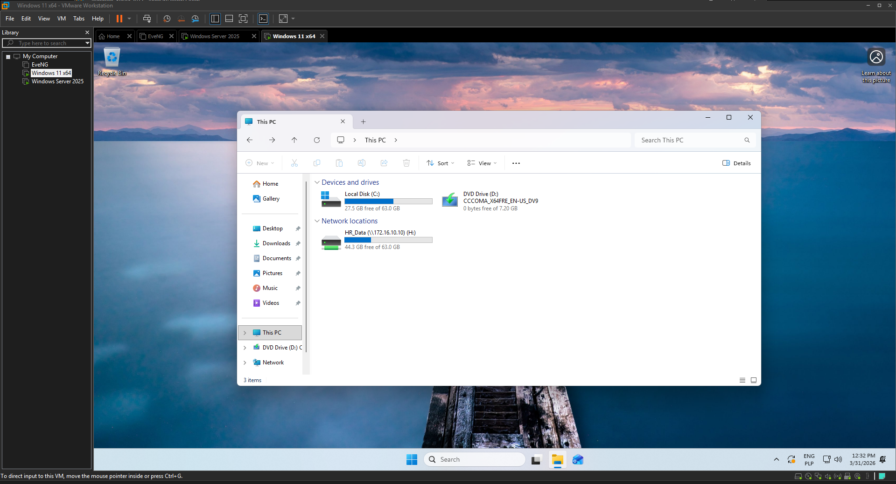

# Windows Server Enterprise AD & GPO Environment 🏢

This project addresses the challenge of decentralized user and device management in a corporate environment. By deploying a Windows Server 2025 Domain Controller, it establishes a centralized Active Directory infrastructure with Role-Based Access Control. It provides automated resource provisioning, zero-touch network configuration via DHCP, optimized DNS resolution and enforces strict security policies across client workstations, simulating a real-world enterprise IT deployment.

## 🛠️ Technologies
* Windows Server 2025 (Evaluation)
* Windows 11 Pro (Evaluation)
* Active Directory Domain Services
* Domain Name System - Forward & Reverse Lookup Zones
* Dynamic Host Configuration Protocol
* Group Policy Management
* VMware Workstation

## ✨ Features
* **Zero-Touch Network Provisioning:** Automated distribution of IP addresses, Subnet Masks, Default Gateways and DNS configurations to endpoint devices via an authorized DHCP server.
   **Advanced DNS Resolution:** Optimized DNS infrastructure featuring Reverse Lookup Zones for PTR record resolution (critical for security logging/SIEM) and DNS Forwarders for seamless external internet access.
* **Centralized Identity Management:** Secure access control for corporate users with forced password resets upon initial login.
* **Hierarchical OU structure:** Organizational Units reflecting actual company departments (HR, IT, Accounting).
* **Enforced security baselines:** Global policies blocking Control Panel and System Settings access for standard users.
* **Automated Resource Mapping:** Dynamic network drive mapping based on departmental group membership using Group Policy Preferences.

## ⚙️ The Process
* **Architecture Setup:** Configured a static IP (`172.16.10.10`) for the Windows Server and established a private virtual network to isolate the lab environment.
* **AD DS & DNS Installation:** Installed the required roles and promoted the server to a Domain Controller, creating the `caprincho-corp.local` forest.
* **OU & User Provisioning:** Designed the initial OU hierarchy and created standard user accounts, enforcing the "User must change password at next login" security standard.
* **GPO Deployment:** Created and linked specific Group Policy Objects to restrict system settings globally and map SMB shares exclusively for the HR department.
* **Endpoint Integration:** Configured the Windows 11 to acquire its network configuration dynamically via DHCP and successfully joined the workstation to the domain to verify policy application.
* **DHCP Implementation (V1.1):** Deployed and AD-authorized the DHCP server role. Configured an IPv4 scope (`172.16.10.1` - `172.16.10.254` with exclusions for static IPs `.1` - `.100`). Ensured clients automtically receive the Default Gateway (`172.16.10.2`) and resolve the Domain Controller as their primary DNS.
* **DNS Optimization (V1.2):** Created Reverse Lookup Zones for the `172.16.10.x` subnet to enable IP-to-hostname resolution. Verified DNS Forwarders to ensure reliable external internet connectivity for domain clients.

## 📊 Proof of Concept / Testing

 *> Windows 11 client side: Command prompt showing successful forward and reverse DNS resolution using the `nslookup` utility.*

 *> Windows 11 client side: Command prompt showing `ipconfig /all` with successfully acquired DHCP lease, DNS and Gateway from the authorized Domain Controller.*

 *> Active Directory Users and Computers console displaying the mapped organizational structure.*

 *> Group Policy Management console showing linked security and resource policies.*

 *> Windows 11 client side: Standard user receiving an "Access Denied" prompt when attempting to open the Control Panel.*

 *> Windows 11 client side: HR user successfully receiving the mapped 'H:' drive upon login.*

## 💡 What I Learned
* Deployment and AD-authorization of DHCP services to provide zero-touch network configuration for client endpoints.
* Deepened understanding of AD DS architecture and configured advanced DNS features (Reverse Lookup Zones, Forwarders) essential for enterprise network health and security logging.
* Learned how to effectively structure OUs to make GPO application logical, scalable, and manageable.
* Mechanics of joining a client OS to a domain and managing local vs. domain credentials.
* Improved troubleshooting skills regarding network connectivity and DNS/DHCP resolution between virtual machines.

## 🚀 What can be improved
* Automate the entire user provisioning process using PowerShell scripts reading from a CSV file (coming up in Version 2.0).
* Implement a secondary Domain Controller for High Availability and replication testing.
* Add advanced GPOs, such as deploying software automatically or mapping specific network printers.

## How to run the Project
1. Download Windows Server 2025 and Windows 11 ISOs from the Microsoft Evaluation Center.
2. Create two virtual machines in your Hypervisor and place them on the same internal virtual network.
3. Assign a static IP (e.g., `192.168.10.10`) to the Windows Server and install the AD DS, DNS and DHCP roles via Server Manager.
4. Promote the server to a Domain Controller (create a new forest, e.g., `corp.local`).
5. Configure DNS by adding a Reverse Lookup Zone for your subnet and setting up DNS Forwarders (e.g., `8.8.8.8`, `1.1.1.1`).
6. Authorize the DHCP server in Active Directory and configure a new IPv4 Scope (e.g., `192.168.10.0/24`) with proper DNS and Router options.
7. On the Windows 11 VM, ensure the Network Adapter is set to obtain an IP address automatically (DHCP).
8. Join the Windows 11 VM to the domain via Settings -> Accounts -> Access work or school, click Connect, and select "Join this device to a local Active Directory domain". Enter the domain name, followed by credentials with domain-join permissions, then restart.
9. Use `dsa.msc` and `gpmc.msc` on the server to recreate the OU structure and test GPOs by logging into the Windows 11 VM with a domain account.
